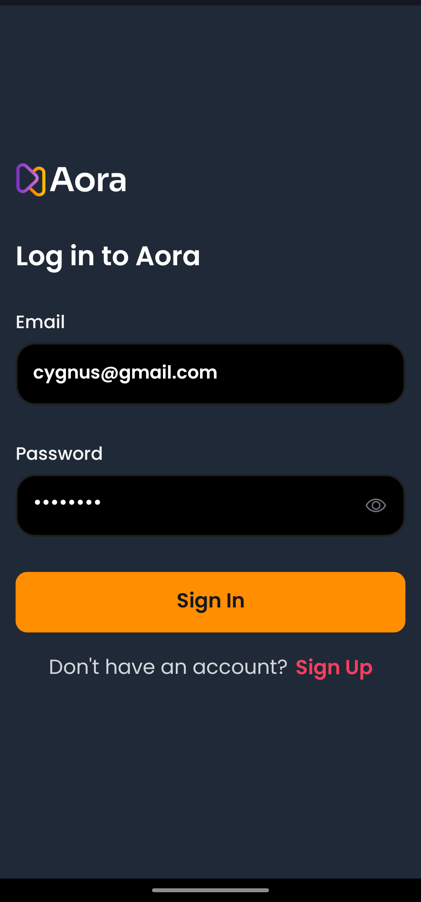
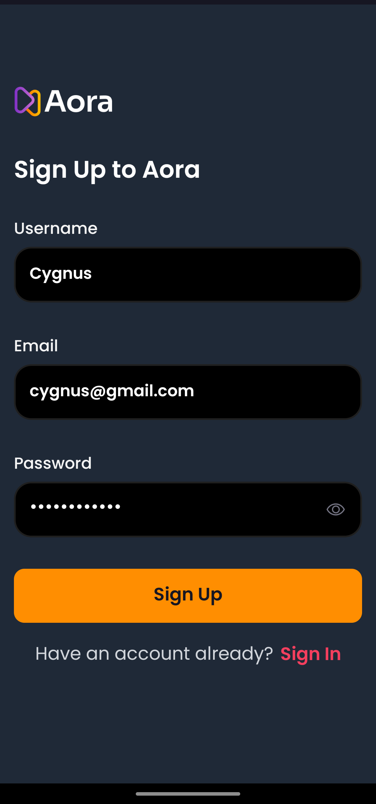
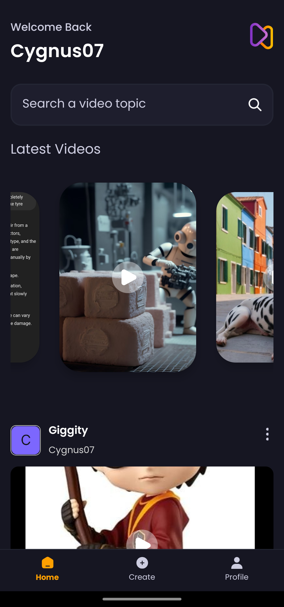
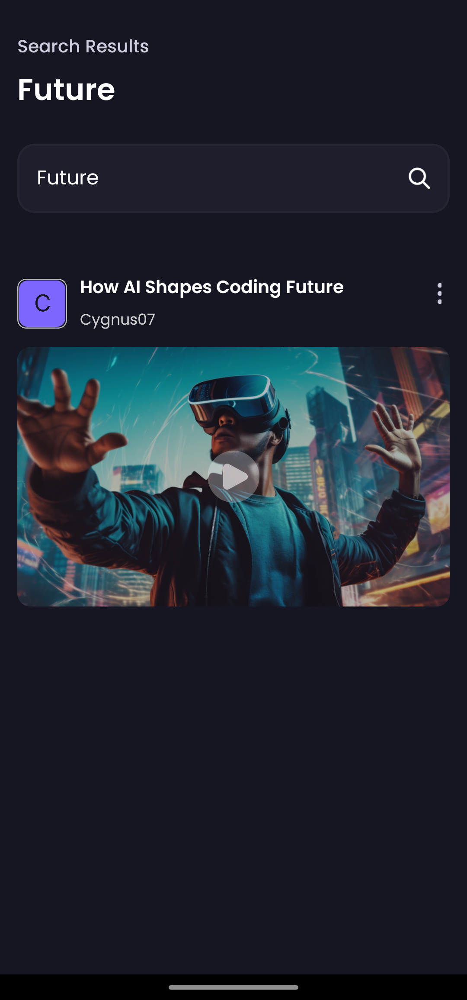
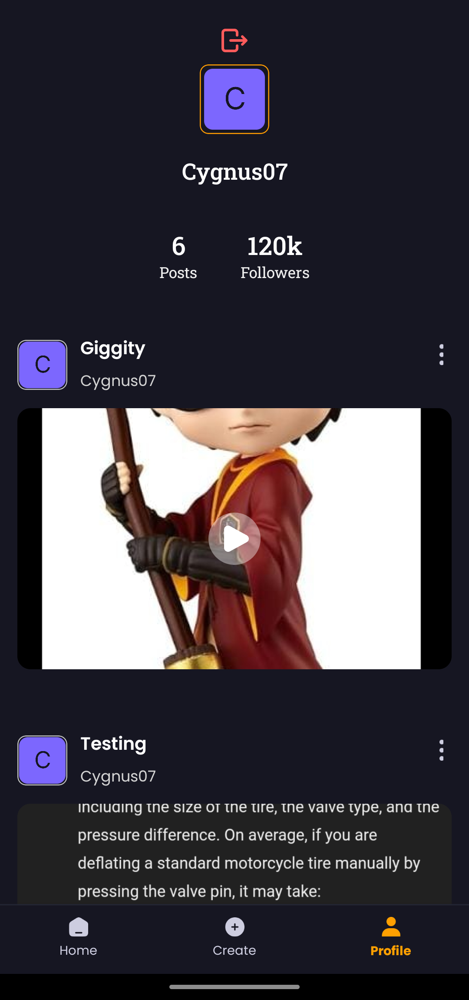

Here's a README file for your project:

---

# Aora

Aora is a React Native app that allows users to upload AI-generated videos along with custom thumbnails and the prompt used to generate the video. Users can sign up, log in, upload their own videos, and view others' videos. The app features email-based authentication and uses Appwrite for backend services to store user details, videos, and images.

## Features

- **User Authentication**: Sign up and log in using email.
- **Upload AI-Generated Videos**: Users can upload videos with custom thumbnails and share the prompt they used.
- **Explore Videos**: Browse through videos uploaded by other users.
- **Storage on Appwrite**: User data, videos, and images are securely stored using Appwrite.

## Tech Stack

- **Frontend**: React Native, Expo, NativeWind, TailwindCSS
- **Backend**: Appwrite
- **Navigation**: React Navigation
- **UI Components**: NativeWind, React Native Animatable, Expo AV
- **Other Dependencies**:
  - Vector Icons: `@expo/vector-icons`
  - Gesture Handling: `react-native-gesture-handler`
  - Animations: `react-native-reanimated`, `react-native-animatable`
  - Document Picker: `expo-document-picker`
  - Image Picker: `expo-image-picker`

## Screenshots

Here are some screenshots from the app:










## Installation and Setup

### Prerequisites
- Make sure you have [Node.js](https://nodejs.org/) and [Expo CLI](https://docs.expo.dev/get-started/installation/) installed.
- [Appwrite](https://appwrite.io/) setup for backend (or use your existing Appwrite instance).

### Steps

1. **Clone the Repository**:
   ```bash
   git clone https://github.com/cygnus07/Aora.git
   cd Aora
   ```

2. **Install Dependencies**:
   ```bash
   npm install
   ```

3. **Setup Appwrite**:
   - Ensure that your Appwrite backend is up and running.
   - Configure your Appwrite project in the app, adding your `projectId`, `endpoint`, and other necessary credentials.

4. **Run the App**:
   For Android:
   ```bash
   npm run android
   ```

   For iOS:
   ```bash
   npm run ios
   ```

   For Web:
   ```bash
   npm run web
   ```

5. **Reset Project (Optional)**:
   If you need to reset the project:
   ```bash
   npm run reset-project
   ```

## Usage

- **Sign up or log in** with your email to start using the app.
- **Upload AI-generated videos** by selecting a video, adding a thumbnail, and providing the prompt.
- **Explore videos** uploaded by others on the main gallery screen.

## Learning Journey

This app was created as a personal project to learn React Native and integrate various features such as authentication, media uploads, and backend integration using Appwrite. It’s a portfolio project showcasing my skills in building mobile apps with modern technologies.

## License

This project is licensed under the MIT License - see the [LICENSE](LICENSE) file for details.

---

You can now copy this into your `README.md` file! Let me know if you'd like any further modifications.